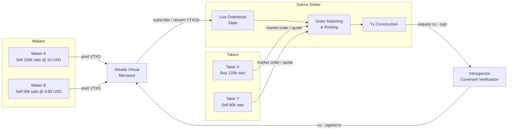

# Striker

**A trade execution layer for Arkade's non-interactive swap protocol**

---

## The Problem

A non-interactive swap protocol requires **takers to do all the heavy lifting**:

```
┌─────────┐     ┌──────────────────┐     ┌─────────────┐
│  Maker  │────>│  Virtual Mempool │<────│    Taker    │
│         │     │   (Orderbook)    │     │             │
└─────────┘     └──────────────────┘     └──────┬──────┘
                                                │
                                         1. Sync full orderbook locally
                                         2. Find matching orders
                                         3. Handle partial fills manually
                                         4. Construct spend tx
                                         5. Submit - hope VTXO isn't stale
```

**This breaks down in practice:**

- Users must **rebuild the orderbook locally** before every trade
- By the time a slow client constructs a valid spend tx, the **VTXO may already be spent**
- No way to aggregate partial fills or route across multiple orders
- Every taker is on their own - no bundling of multiple orders

---

## The Solution: A Matching Engine

An **execution service** with a live, authoritative view of the orderbook that matches and executes trades on behalf of
users.



**How it works:** Makers post VTXOs with covenant scripts (limit orders) directly to the Arkade virtual mempool - no
interaction with Satora Striker needed.
Satora Striker **subscribes** to the mempool, indexes incoming VTXOs, and builds a live orderbook from them.
When a taker submits an order, Striker matches it, constructs the spend tx, and sends it to the **Introspector**.
The Introspector verifies the covenant is respected and co-signs - only then does the tx settle.

---

## Advantages of this service

| Without Engine              | With Engine                               |
|-----------------------------|-------------------------------------------|
| Taker syncs full orderbook  | Engine maintains live state               |
| Manual order discovery      | Price-time priority matching              |
| Single order per tx         | Partial fill aggregation across orders    |
| Stale VTXOs = failed trades | Engine knows real-time VTXO liveness      |
| No cross-pair routing       | Multi-hop trades (e.g. BTC -> USD -> EUR) |
| Client builds spend tx      | Engine constructs optimized tx            |

**The core insight:** the matching engine has an information advantage.
It sees the live state of all VTXOs, can pre-validate spendability, and construct transactions against orders it *knows*
are still valid.
Individual clients racing against a changing orderbook cannot compete with this.

---

## Feature Set

**Core (v1)**

- Limit orders (maker)
- Market orders (taker) - fill at best available price
- Partial fill aggregation - combine multiple small orders into one trade
- Price-time priority matching
- Quote API - "how much BTC for 50 USD?" / "how much USD for 100k sats?"

**Extended (v2)**

- Batch execution - group multiple fills into optimized transactions
- Maker-to-maker matching - two limit orders that cross each other
- Multi-hop routing - swap through intermediate pairs
- `amountIn` / `amountOut` quote modes (Uniswap-style interface)
- 'Register' with XPUB to track trades and reduce trading fees by volume

---

## Fee Model

**Taker-pays, basis-point fee on execution.**

|        | Fee        | Rationale                                                |
|--------|------------|----------------------------------------------------------|
| Makers | 0 bps      | Incentivize liquidity - makers provide the orderbook     |
| Takers | ~10-30 bps | Takers pay for execution quality, speed, and reliability |

Fee is embedded in the constructed transaction - transparent and verifiable.

---

**Trust model:** Satora Striker is a convenience layer, not a custodian.
The **Introspector** co-signs every transaction - it verifies the maker's covenant is respected before the tx is
submitted.
If the terms aren't met, the Introspector refuses to sign and the tx never hits the mempool.
The engine cannot steal funds or alter terms.
Worst case: the engine goes down, users fall back to manual orderbook interaction.

---

## Summary

Assuming the swap primitives exist: covenants scripts and the Introspector, the missing piece is a service that ties them together into something users actually want to trade on.
Striker is that piece: it watches the mempool, matches orders, builds transactions, and gets them co-signed.
Users get fast, reliable fills.

