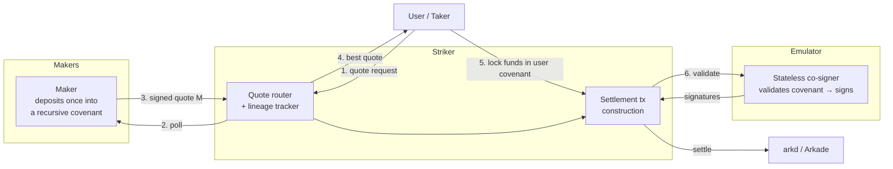

# Striker

**An intent-based swap layer for Arkade — NEAR Intents, settled with recursive covenants.**

---

## The idea in one breath

A maker deposits liquidity once into a covenant and signs quotes off-chain. A user asks Striker for
a price; Striker polls the makers; the best signed quote comes back. The user locks their funds in a
covenant that guarantees they receive at least the quoted amount, and an atomic transaction settles
the swap. The maker never has to be online to be filled, and Striker never custodies a satoshi.

It's [NEAR Intents](https://docs.near-intents.org), rebuilt on Bitcoin: the quote lives in a signed
message, not in an on-chain order, and the chain itself does the accounting.

---

## Why the previous model didn't scale

The earlier design encoded each quote *inside* a covenant script and posted it as a VTXO — an
orderbook made of on-chain outputs. That forces takers to sync the whole book, race against stale
VTXOs, and rebuild state before every trade. The matching engine helps, but the fundamental problem
remains: **the price is welded to a specific output**, so every requote is an on-chain action and
every taker is racing a moving book.

The fix is to move the quote off-chain and make the covenant generic.

---

## How it works

```
0. Maker deposits funds into a recursive covenant (once).
1. User wants to sell 100 BTC for USDT.
2. User asks Striker for a quote.
3. Striker polls all makers.
4. Each maker returns a SIGNED MESSAGE authorizing "take X of my USDT if Y BTC goes to my address".
5. Striker returns the best quote to the user.
6. User locks 100 BTC in a covenant that enforces "I receive at least the quoted USDT".
   → One atomic tx spends both covenants and settles the swap.
```

The key inversion: **the quote is encoded in the redeem data of the spend, not in the covenant
script.** The maker's covenant is a generic, reusable rule — "spend `X` if I signed a message
authorizing it and `Y` is paid to my address" — built on `OP_CHECKSIGFROMSTACK`. A single deposit
can satisfy any quote the maker chooses to sign, without ever re-posting.



---

## The fungible covenant — the whole trick

A maker's deposit is a **recursive, state-carrying covenant**. When it's filled, the spend:

- pays `X` of the asset to the taker,
- pays `Y` to the maker's address,
- and sends the **change back into an identical covenant**.

So the deposit behaves like a NEAR-style fungible balance: each fill draws it down, the remainder
chains forward, and one deposit fills many quotes in sequence. The balance is just the VTXO value;
an **epoch** counter rides in the covenant so the maker can bulk-cancel its own outstanding quotes
with a single self-spend.

This is the part that makes intents work on a UTXO chain. The mechanism — recursive covenants,
state-carrying packets, `OP_CHECKSIGFROMSTACK`, BigNum arithmetic — is all confirmed against
[arkade-os/emulator](https://github.com/arkade-os/emulator). Full spec in **[DESIGN.md](./DESIGN.md)**.

---

## How over-commitment is prevented

A maker can sign unlimited overlapping quotes against the same deposit. Only one fill can settle —
spending the deposit consumes it, and Arkade's single-spend rule makes every competing fill fail.
This is the same guarantee NEAR gets from atomic check-and-debit, except the enforcer is the chain,
not a contract:

| NEAR Intents | Striker |
|---|---|
| Solver signs a `token_diff` intent | Maker signs a quote, verified via `OP_CHECKSIGFROMSTACK` |
| Stable fungible balance in the Verifier | Recursive covenant — change chains the balance forward |
| Atomic check-and-debit (`execute_intents`) | Arkade VTXO single-spend |
| Global salt rotation to cancel | Maker bumps its own epoch (per-lineage, self-sovereign) |
| Verifier validates **and** executes | Emulator validates (stateless); `arkd` executes |
| Nonce state in contract storage | State on-chain in the covenant — no database |

---

## Trust model

Striker is a convenience layer, not a custodian.

- **Striker** is untrusted. It routes quotes and builds transactions; it cannot steal or alter terms
  because the covenants and the Emulator enforce them. If it goes down, users fall back to manual
  interaction.
- **The Emulator** co-signs every spend, validating the covenant in software. It holds no state and
  cannot steal — at worst it can censor, and the backstop is the Arkade unilateral exit to L1.
- **Makers** are fully self-sovereign: withdraw or requote at any time via a key path.
- **Users** lock funds behind a covenant that guarantees the quoted amount, with a **non-timelocked
  refund** they can take any time the swap hasn't settled.

---

## Feature set

**v1**
- Off-chain signed quotes (RFQ) over a generic, reusable maker covenant
- Recursive fungible deposits — one deposit fills many quotes
- Partial-fill aggregation — multiple maker inputs in one settlement tx
- Quote API — "how much USDT for 100k sats?" / "how much BTC for 50 USD?"
- Self-sovereign maker cancel (epoch bump) and withdraw

**v2**
- Rate-based quotes (`required_Y = X · rate`) — feasible today via BigNum multiplication
- Multi-hop routing (BTC → USD → EUR)
- Maker-to-maker matching
- `amountIn` / `amountOut` quote modes
- XPUB registration for volume-tiered taker fees

---

## Fee model

**Taker-pays, basis points on execution.** Makers pay 0 bps to incentivize liquidity; takers pay
~10–30 bps for execution quality and speed. The fee is an output in the settlement tx — transparent
and verifiable.

---

## Summary

Assuming Arkade's swap primitives — recursive covenants, the Emulator, `OP_CHECKSIGFROMSTACK` — the
missing piece is a service that ties them into something people can trade on. Striker is that piece:
it routes quotes, tracks maker liquidity, builds settlement transactions, and gets them co-signed.
Users get fast, reliable, non-custodial fills.

See **[DESIGN.md](./DESIGN.md)** for the full mechanism.
